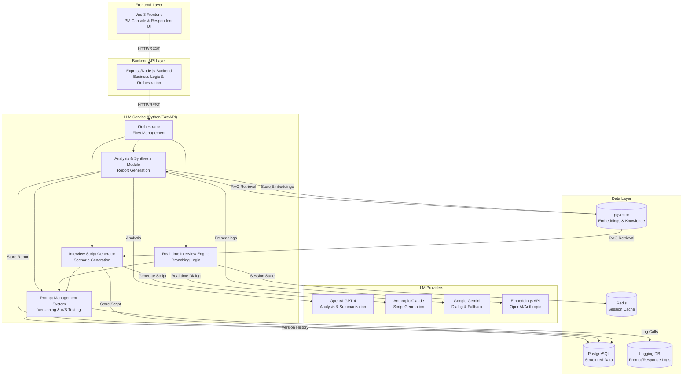

# Архитектура LLM-системы CustDevAI

## Обзор системы

CustDevAI использует микросервисную архитектуру с выделенным LLM Service для генерации сценариев интервью, проведения диалогов и анализа ответов.

## Диаграмма архитектуры



## Компоненты системы

### 1. Orchestrator (Ядро управления потоком)

**Назначение:** Центральный координатор всех LLM операций, управляет жизненным циклом интервью.

**Технологии:**
- Python/FastAPI
- LangChain для оркестрации цепочек вызовов
- Celery/Redis для асинхронных задач

**API Contracts:**
```python
POST /api/v1/interviews/start
  Request: { projectId, segment, hypothesis, metadata }
  Response: { interviewId, script, initialQuestion }

POST /api/v1/interviews/{interviewId}/next
  Request: { interviewId, answer, context }
  Response: { nextQuestion, branch, isComplete }

POST /api/v1/interviews/{interviewId}/analyze
  Request: { interviewId }
  Response: { analysis, clusters, recommendations }
```

**Взаимодействие:**
1. Принимает запрос на создание интервью → вызывает Script Generator
2. Управляет потоком вопросов → вызывает Interview Engine
3. По завершении → вызывает Analysis Module
4. Логирует все вызовы через Prompt Management System

### 2. Interview Script Generator (Генератор сценариев)

**Назначение:** Генерирует структурированные сценарии интервью на основе сегмента, JTBD и гипотезы.

**Технологии:**
- **Primary Model:** Anthropic Claude 3.5 Sonnet (лучше для структурированной генерации)
- **Fallback:** GPT-4 Turbo
- LangChain для промпт-шаблонов
- Pydantic для валидации структуры

**Процесс:**
1. Получает контекст из векторной БД (лучшие практики CustDev)
2. Генерирует сценарий с ветвлениями
3. Валидирует структуру (длина, типы вопросов, логика ветвлений)
4. Сохраняет версию промпта и результат

**RAG Integration:**
- Поиск похожих успешных сценариев через pgvector
- Извлечение лучших практик из базы знаний
- Контекстная подсказка на основе прошлого опыта

### 3. Real-time Interview Engine (Движок проведения интервью)

**Назначение:** Ведет диалог в реальном времени с branching logic и адаптацией вопросов.

**Технологии:**
- **Primary Model:** Google Gemini Pro (быстрый ответ, хорошая поддержка диалога)
- **Fallback:** GPT-4 Turbo для сложных ветвлений
- Redis для хранения состояния сессии
- Streaming API для real-time ответов

**Контекстное окно:**
- **Sliding Window:** Последние 10-15 обменов (вопрос-ответ)
- **Summary Compression:** Периодическое сжатие старых частей диалога через summarization
- **Key Facts Extraction:** Извлечение ключевых фактов в отдельную структуру
- **Session Memory:** Хранение состояния в Redis (TTL 24 часа)

**Branching Logic:**
- Rule-based правила для простых ветвлений
- LLM-based анализ для сложных сценариев
- Динамическая адаптация на основе ответов

### 4. Analysis & Synthesis Module (Модуль анализа)

**Назначение:** Анализирует все ответы, создает кластеры, генерирует отчеты и рекомендации.

**Технологии:**
- **Primary Model:** GPT-4 Turbo (лучше для анализа и summarization)
- **Embeddings:** OpenAI text-embedding-3-large или Anthropic embeddings
- pgvector для хранения и поиска эмбеддингов
- Scikit-learn для кластеризации (agglomerative clustering)

**Процесс:**
1. Генерация эмбеддингов для всех ответов
2. Кластеризация цитат (N=15-30 респондентов)
3. Извлечение топ-тем и паттернов
4. Summarization каждого кластера
5. Генерация вердикта (go/iterate/stop)
6. Расчет метрик (WTP, острота проблемы)

**Контекстное окно для анализа:**
- **Batch Processing:** Все ответы обрабатываются вместе
- **Hierarchical Summarization:** Сначала кластеры, затем общий summary
- **Incremental Updates:** При поступлении новых ответов - инкрементальное обновление

### 5. Prompt Management & Versioning System

**Назначение:** Управление версиями промптов, A/B тестирование, логирование всех вызовов.

**Технологии:**
- PostgreSQL для хранения версий промптов
- Structlog для структурированного логирования
- Prometheus для метрик
- Correlation IDs для трассировки

**Функции:**
- Версионирование промпт-шаблонов (Git-like подход)
- A/B тестирование разных формулировок
- Логирование всех LLM вызовов (промпт, ответ, метрики)
- Анализ эффективности промптов
- Rollback к предыдущим версиям

## Векторная база знаний

**Технологии:**
- **pgvector** (Supabase/PostgreSQL) для хранения эмбеддингов
- **Embedding Model:** OpenAI text-embedding-3-large (1536 dims)

**Структура:**
```sql
-- Таблица знаний о CustDev практиках
CREATE TABLE custdev_knowledge (
  id UUID PRIMARY KEY,
  content TEXT,  -- Лучшие практики, примеры сценариев
  embedding vector(1536),
  metadata JSONB,  -- тип, источник, рейтинг
  created_at TIMESTAMP
);

-- Таблица успешных сценариев
CREATE TABLE successful_scenarios (
  id UUID PRIMARY KEY,
  scenario JSONB,  -- Структурированный сценарий
  embedding vector(1536),  -- Embedding всего сценария
  metrics JSONB,  -- Метрики успеха (CR, качество ответов)
  created_at TIMESTAMP
);
```

**Использование:**
- RAG для Script Generator: поиск похожих успешных сценариев
- RAG для Analysis: сравнение с прошлыми исследованиями
- Постоянное обогащение базы знаний из успешных кейсов

## Воспроизводимость и контроль качества

### Версионирование промптов
- Git-like система версий в PostgreSQL
- Теги для production/staging/experimental
- Rollback механизм

### Логирование
- Все LLM вызовы логируются с:
  - Промпт (полный текст)
  - Ответ модели
  - Метаданные (модель, температура, токены, стоимость, latency)
  - Correlation ID для трассировки
  - Без PII данных

### A/B тестирование
- Система экспериментов с разными промптами
- Метрики сравнения (качество сценария, CR, качество ответов)
- Автоматический выбор лучшей версии

### Детерминизм
- Seed для воспроизводимости (где возможно)
- Temperature=0 для критичных частей (валидация, структурирование)
- Temperature=0.7 для творческих задач (генерация вопросов)

## Технологический стек (сводка)

| Компонент | Технологии |
|-----------|-----------|
| **Orchestrator** | Python/FastAPI, LangChain, Celery, Redis |
| **Script Generator** | Claude 3.5 Sonnet, LangChain, Pydantic, pgvector (RAG) |
| **Interview Engine** | Gemini Pro, Redis (session), Streaming API |
| **Analysis Module** | GPT-4 Turbo, OpenAI Embeddings, pgvector, scikit-learn |
| **Prompt Management** | PostgreSQL, Structlog, Prometheus |
| **Vector DB** | pgvector (Supabase), OpenAI embeddings |
| **Cache/Session** | Redis |
| **Logging** | Structlog, PostgreSQL (logs table) |

## Последовательность вызовов

### Сценарий 1: Создание и проведение интервью

```
1. Frontend → Backend: POST /projects/{id}/scenarios/generate
2. Backend → Orchestrator: POST /api/v1/interviews/start
3. Orchestrator → Prompt Management: Получить актуальный промпт-шаблон
4. Orchestrator → Vector DB: RAG поиск лучших практик
5. Orchestrator → Script Generator: Генерация сценария
6. Script Generator → Claude API: Генерация структурированного сценария
7. Script Generator → Prompt Management: Логирование вызова
8. Script Generator → PostgreSQL: Сохранение сценария
9. Orchestrator → Backend: Возврат сценария
10. Backend → Frontend: Сценарий готов

11. Frontend → Backend: Начало интервью
12. Backend → Orchestrator: POST /api/v1/interviews/{id}/next
13. Orchestrator → Interview Engine: Получить следующий вопрос
14. Interview Engine → Redis: Получить состояние сессии
15. Interview Engine → Gemini API: Генерация следующего вопроса (с контекстом)
16. Interview Engine → Redis: Обновить состояние сессии
17. Interview Engine → Prompt Management: Логирование
18. Orchestrator → Backend: Следующий вопрос
19. Backend → Frontend: Отображение вопроса

(Повторяется для каждого вопроса)

20. Frontend → Backend: Завершение интервью
21. Backend → Orchestrator: POST /api/v1/interviews/{id}/analyze
22. Orchestrator → Analysis Module: Анализ всех ответов
23. Analysis Module → Embeddings API: Генерация эмбеддингов
24. Analysis Module → pgvector: Сохранение эмбеддингов
25. Analysis Module → Clustering: Кластеризация ответов
26. Analysis Module → GPT-4: Summarization кластеров
27. Analysis Module → GPT-4: Генерация вердикта и рекомендаций
28. Analysis Module → PostgreSQL: Сохранение отчета
29. Orchestrator → Backend: Отчет готов
30. Backend → Frontend: Отображение отчета
```

## Масштабирование и производительность

- **Горизонтальное масштабирование:** LLM Service может масштабироваться через Kubernetes
- **Кэширование:** Redis для кэширования частых запросов (похожие сегменты)
- **Асинхронная обработка:** Celery для фоновых задач (анализ, генерация отчетов)
- **Rate Limiting:** Ограничение вызовов LLM API для контроля затрат
- **Circuit Breaker:** Защита от сбоев провайдеров LLM

## Безопасность

- **PII фильтрация:** Автоматическое удаление PII из логов
- **Валидация входных данных:** Проверка размера, формата, токсичности
- **API ключи:** Безопасное хранение в secrets management
- **Rate limiting:** Защита от злоупотреблений
- **Audit log:** Полное логирование всех операций

